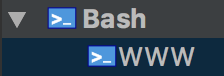
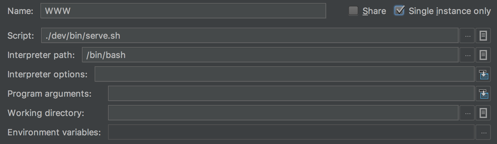

# Personal Website

## 1. Environment
We have chosen to use a 100% container-based development environment.
Therefore, you wont be using your usual IDE's running config.

Instead, read and execute the following setup instructions:

### 1.1. Create your development image
```shell
./dev/bin/build.sh
```
This will create a Docker image named **website:dev**

### 1.2. Clean any existing container named **website**
```shell
./dev/bin/clean.sh
```

### 1.3. In Intellij, add the following Run Configurations
<i>you should see the screenshots below. if you don't, take a look on the gitlab/github repository or open the images in dev/assets.</i>

**Dashboard**  




<i>NOTE</i>: If the bash option is missing from the run configurations, you have to install the Intellij plugin "BashSupport" (<i>File > Settings > Plugins > Browse repositories...</i>)
